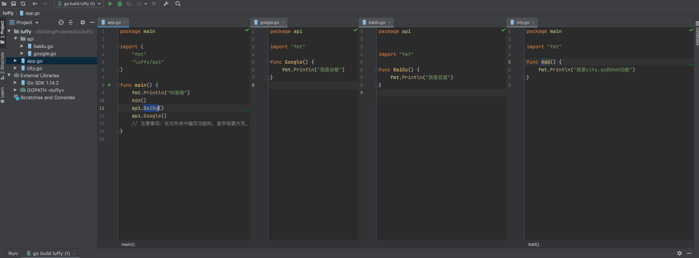
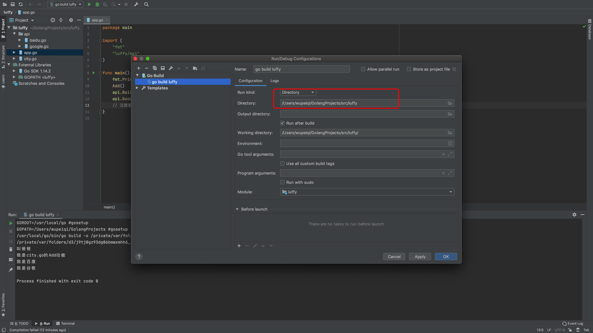
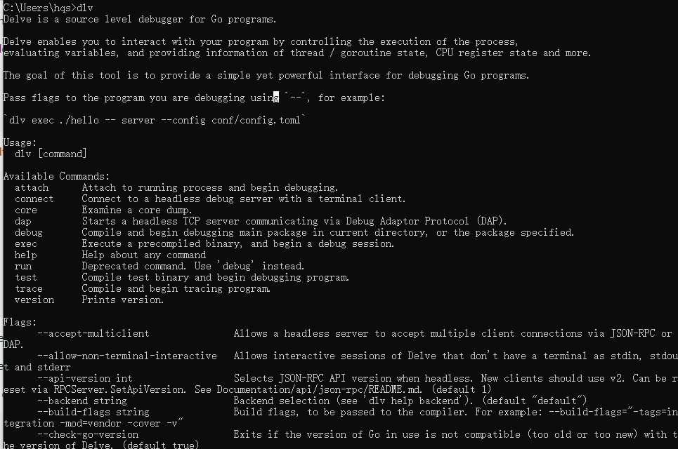

## 一、Goland语言介绍

Go 和 C语言、C++、Python、Java 等一样都是编程语言。学习任何一门编程语言本质上都分3步走：

- 第一步：安装 `解释器 或 编译器`。
- 第二步：学相关编程语言语法，然后写代码。
- 第三步：用已安装`解释器 或 编译器` 去运行自己写的代码，这样代码就会去完成我们编写的功能了。

Go是编译型语言，所以我们一般称Go安装是`编译器`。

Go是开源且跨平台的一门编程语言，所以他支持window、linux、mac操作系统，同时也意味着我们可以在各种系统中安装Go的编译器。

### 1、垃圾回收机制
1. 内存自动回收，再也不需要开发人员管理内存。
2. 开发人员专注业务实现，降低了心智负担。
3. 只需要new分配内存，不需要释放。

### 2、天然并发
1. 从语言层面支持并发，非常简单。
2. goroute，轻量级线程，创建成千上万个goroute成为可能。
3. 基于CSP(Communicating Sequential Process)模型实现。

```go
func main() {
    go fmt.Println("Hello")
}
```

### 3、channel
1. 管道，类似 unix/linux 操作系统的 pipe
2. 多个 goroute 之间通过 channel 进行通信
3. 支持任何类型

```go
package main

import "fmt"

func test_pipe() {
	pipe := make(chan int, 3) // 创建一个管道，管道的容量为3
	pipe <- 1                 // 向管道中写入一个数据
	pipe <- 2                 // 向管道中写入一个数据
	pipe <- 3                 // 向管道中写入一个数据

	pipe <- 4 // 向管道中写入一个数据，管道已经满了，会报错

	fmt.Println(len(pipe))
}
"""
插入三个时输出结果：
PS D:\GolangProjects\src\crm> go run app.go pipe.go
3

插入四个时输出结果：
PS D:\GolangProjects\src\crm> go run app.go pipe.go
fatal error: all goroutines are asleep - deadlock!
"""
```

### 4、多返回值
一个函数返回多个值：
"""go
// calc.go
package main

func calc(a int, b int) (int, int) {
	c := a + b
	d := (a + b) / 2
	return c, d
}

// app.go
func main() {
	sum, avg := calc(200, 300)
	fmt.Println("sum=", sum, "avg=", avg)
}

// 执行程序
PS D:\GolangProjects\src\crm> go run app.go calc.go
sum= 500 avg= 250
"""

### 5、包

#### （1）包概念
1. 和 python 一样，把相同功能的代码放到一个文件夹中，这个文件夹就是一个包。
   - 包名和文件夹名一致。
   - 包名不能包含 - ，必须是小写字母。
   - 包名不能和系统包名重复，比如 fmt，io，os 等。
   - 包名不能和自定义包名重复，比如 luffycity，luffy 等。
2. 包可以被其他包导入，导入的包必须被使用，否则编译不通过。
3. main 包是特殊的包，它包含了可执行程序的入口函数 main()，main 包的包名必须为 main。
4. 包的主要作用是封装代码，提高代码的可重用性。

#### （2）关于包的分类

- main包，如果是main包，则必须写一个main函数，此函数就是项目的入口（main主函数）。 编译生成的就是一个可执行文件。
- 非main包，用来将代码进行分类，分别放在不同的包和文件中。






#### （3）包管理和调用

- 一个文件夹可以称为一个包。
- 在文件夹（包）中可以创建多个文件。
- 在同一个包下的每个为文件中必须指定 `包名称且相同`
- 调用其他包的功能，需要先 import 导入，然后再使用；调用自己包中的功能时，直接调用即可（无需导入）
- 文件中的函数首字母是小写，表示此函数只能被当前包内部文件调用。首字母是大写，则意味着任何包都可以调用。

### 6、输出

在终端将想要展示的数据显示出来，例如：欢迎登录、请输入用户名等。。。

- 内置函数
  - print
  - println
- fmt包（推荐）
  - fmt.Print
  - fmt.Println

扩展：进程里有 stdin/stdout/stderr 。

```go
package main

import "fmt"

func main() {
	// 基于内置函数（不推荐）
	//print("Hello world! \n")
	//print("打印试一试 \n")
	//println("Hello world!")
	//println("打印试一试")

	// fmt包（推荐）
	//fmt.Print("Hello world! \n")
	//fmt.Print("打印试一试 \n")
	//fmt.Println("Hello world!")
	//fmt.Println("打印试一试")
	//fmt.Println("我叫", "jack", "我打印", "试试", "....")
	//fmt.Println("打印试一试....")

	// fmt包 扩展：格式化输出
	// %s，占位符 "文本"
	// %d，占位符 整数
	// %f，占位符 小数（浮点数）
	// %.2f，占位符 小数（保留小数点后2位，四舍五入）
	// 百分比
	fmt.Printf("谁%s,去接%s，多少钱一次？%d块。给打折吧，%.2f怎么样？包你100%%满意", "车", "老男孩", 100, 3.889)
}
```

### 7、注释

- 单行注释， //
- 多行注释， /*    */

快捷：contrl + ?


## 二、Mac系统

### 1、下载Go编译器

https://golang.google.cn/

### 2、点击安装


默认的安装目录：`/usr/local/go/`

编译器启动文件：`/usr/local/go/bin/go`

### 3、配置环境PATH

```
export PATH=/usr/local/go/bin:$PATH
```

### 4、其他配置

#### （1）创建一个任意目录

此目录以后放你写的所有go代码。

```
/Users/hqs/GolangProjects/
- bin,通过go install编译时候，生成的可执行文件。
- pkg,通过go install编译时候，生成的包文件。
- src,放我们以后编写的所有go代码和依赖。
	- crm
		- app.go
	- luffcity
		- xx.go
```

#### （2）配置环境变量

```
// Go安装目录
export GOROOT=/usr/local/go
// 代码和编译之后的文件相关代码
export GOPATH=/Users/hqs/GolangProjects
// 存放编译之后的文件
export GOBIN=/Users/hqs/GolangProjects/bin
```


### 5、环境变量“持久化”

vim ~/.bash_profile

```
export PATH=/usr/local/go/bin:$PATH
export GOROOT=/usr/local/go
export GOPATH=/Users/hqs/GolangProjects
export GOBIN=/Users/hqs/GolangProjects/bin
```


### 6、编写go代码

```
$GOPATH
├── bin
├── pkg
└── src
    └── crm
        └── app.go
```

```go
package main

import "fmt"

func main() {
    fmt.Println("Hello, World! ")
}
```


### 7、运行

本质上就是让Go编译器去运行咱们编写的代码。


方式1：

```go
// 先进入项目目录
go run app.go
```


方式2（推荐）：

```go
// 先进入项目目录

// 编译代码
go build
// 运行
./crm
```


方式3：

```go
// 先进入项目目录
go install 

// 去bin运行
./crm
```

```
$GOPATH
├── bin
│   └── crm
├── pkg
└── src
    └── crm
        └── app.go
```


## 二、Linux系统

### 1、下载Go编译器

https://golang.google.cn/

### 2、安装

```
安装目录
/opt/go
```

启动Go编译器文件：`/opt/go/bin/go`

### 3、配置环境变量PATH

```
export PATH=/opt/go/bin:$PATH
```

### 4、其他配置

#### （1）创建一个任意目录

存放咱们编写的所有项目代码，编译文件之后存放编译后的文件。

```
/home/hqs/GolangProjects/
- bin,在执行go install 命令，生成的可执行文件的目录。
- pkg,在执行go install 命令，存放生成的包文件。
- src,以后编写的所有Go代码都会放在这个目录。
	- crm
		- app.go
	- test
		- lk.go
```

#### （2）环境变量的配置

```
export GOROOT=/opt/go
export GOPATH=/home/hqs/GolangProjects
export GOBIN=/home/hqs/GolangProjects/bin
```


### 5、环境变量的“持久化”

vim ~/.bash_profile

```go
export PATH=/opt/go/bin:$PATH
export GOROOT=/opt/go
export GOPATH=/home/hqs/GolangProjects
export GOBIN=/home/hqs/GolangProjects/bin
```


### 6、编写go代码

```
/home/hqs/GolangProjects（简写$GOPATH）
├── bin
├── pkg
└── src
    └── crm
        └── app.go
```

```go
package main
import "fmt"
func main() {
    // 调用Println函数在屏幕输出:Hello, World! 
    fmt.Println("Hello, World! ")
}
```


### 7、运行代码

本质上将写好的代码交给Go编译器去执行。

方式1：

```
// 进入项目目录
go run app.go
```


方式2（推荐）：

```
// 进入项目目录

// 编译代码并生成一个可执行文件
go build  

// 运行
./crm
```


方式3：

```
// 进入项目目录

// 编译代码，把编译之后的结果会放在 bin/pkg目录
go install 

// 运行
./crm
```

```
├── bin
│   └── crm
├── pkg
└── src
    └── crm
        └── app.go
```

Go程序员的项目：

- 产出一个可执行文件。
- 产出一个包文件。


## 三、Windows系统


### 1、下载Go编译器

https://golang.google.cn/


### 2、点击安装

建议安装：`C:\Go`

### 3、环境变量PATH

以便于以后运行GO编译器时，无需再写路径。


### 4、其他配置

#### （1）创建一个任意目录

以后咱们的go项目都要按照要求放在这个目录。

```
D:\GolangProjects
 - bin,go install在编译项目时，生成的可执行文件会放到此目录。
 - pkg,go install在编译项目时，生成的包文件会放到此目录。
 - src,以后所有的项目都要放在这个目录。
 	- crm
 		- app.go
	- test
		- xx.go
```

#### （2）环境变量配置


### 5、编写代码

```
D:\GolangProjects
 - bin
 - pkg
 - src,以后所有的项目都要放在这个目录。
 	- crm
 		- app.go
```

```go
package main

import "fmt"

func main() {
    fmt.Println("Hello, World! ")
}
```


### 6、运行

本质上就是把Go代码交给Go编译器去执行。

方式1：

```
// 进入项目目录
go run app.go
```

方式2（推荐）：

```
// 进入项目目录
go build

crm.exe
```

方式3：

```
// 进入项目目录
go install

执行 crm.exe
```

```
D:\GolangProjects
 - bin
 	- crm.exe
 - pkg
 	- windows_amd64
 		- utils.a
 - src,以后所有的项目都要放在这个目录。
 	- crm
 		- app.go
 	- utils
 		- page.go
```

平时开发：

- 开发可执行文件，用来让用户使用。
- 开发一个包文件，其他项目来进行调用。


## 四、安装总结

首先要去下载Go编译器，然后进行安装，在安装目录下就是GO编译器相关的所有内容。

```
mac:     /etc/local/go/
linux:   /opt/go/
windows: C:\go\
```

在安装目录下有 bin目录中有一个go可执行文件，基于他来启动编译器。

- 直接通过路径找到可执行文件去运行（麻烦）
- 将 `/etc/local/go/bin` 目录添加PATH环境变量中。

那么在终端就可以执行执行`go version`，调用咱们安装的编译器。


如果想要正确的使用go编译器，还需做一些相关的配置（其他语言）。

- 创建目录，用于存放项目代码、编译后的可执行文件、编译后的包文件。

  ```
  xxxx
  - bin
  - pkg
  - src
  	- crm
  		app.go
  ```

- 环境变量

  ```
  GOROOT,GO编译器安装目录。
  GOPATH，用于存放项目代码、编译后的可执行文件、编译后的包文件（go 1.11版本后，go mod）。
  GOBIN，编译后的可执行文件存放的目录。
  ```

  

编写代码，然后进行。

写了两个项目：

- crm，编译后生成一个可执行文件。
- utils，编译后生成一个包文件。

运行项目

- go run，运行项目代码，内部会先编译并将编译后的文件放在系统的临时目录，然后再自动执行。
- go build，运行项目代码，手动编译并生成一个可执行文件，然后再自动执行。
- go install ，生成可执行文件 + 包文件，并且会将编译后的文件放在bin/pkg目录。


## 五、开发工具

- Goland，IDE（继承开发环境）【收费】
- vscode，编辑器 + 第三发组件  【免费】

### 1、vscode中需要安装插件
Go、Code Runner。

### 2、安装调试工具delve
1、拉取最新 delve 项目代码到本地，编译安装
（1）linux 或 windows 系统：
```bash
# cd $GOPATH/src/          示例：    # cd D:\GolangProjects\src
# git clone https://github.com/go-delve/delve.git
# cd delve/cmd/dlv/
# go build
# go install
```

（2）mac 系统
```bash
brew install go-delve/delve/delve
```

2、添加$GOPATH/bin到环境变量

我这里是在环境变量中添加 `D:\GolangProjects\bin`。  
重启cmd命令提示符后，可以执行： `dlv`。则说明已经安装成功。




### 3、下载Goland

https://www.jetbrains.com/go/


### 4、项目开发

- 新项目
- 打开老项目

注意：项目放在 `$GOPATH/src`目录。


### 5、go module介绍

go module是go官方自带的go依赖管理库,在1.13版本正式推荐使用。

#### （1）go.mod 文件
go module可以将某个项目(文件夹)下的所有依赖整理成一个 go.mod 文件,里面写入了依赖的版本等 使用go module之后我们可不用将代码放置在src下
使用 go module 管理依赖后会在项目根目录下生成两个文件 go.mod（会记录当前项目的所依赖）和go.sum（记录每个依赖库的版本和哈希值）

#### （2）GO111MODULE 
GO111MODULE 是 go modules 功能的开关。

1. GO111MODULE=off，无模块支持，go命令行将不会支持module功能，寻找依赖包的方式将会沿用旧版本那种通过vendor目录或者GOPATH模式来查找。
2. GO111MODULE=on，模块支持，go命令行会使用modules，而一点也不会去GOPATH目录下查找。
3. GO111MODULE=auto，默认值，go命令行将会根据当前目录来决定是否启用module功能。这种情况下可以分为两种情形：
    - 当前目录在GOPATH/src之外且该目录包含go.mod文件，开启模块支持。
    - 当前文件在包含go.mod文件的目录下面。

#### （3）Go mod使用方法
```bash
//初始化模块：
Go mod init <项目模块名称>

//依赖关系处理，根据go.mod文件
Go mod tidy

//将依赖包复制到项目的vendor目录
Go mod vendor

//显示依赖关系
Go list -m all

//显示详细依赖关系
Go list -m -json all

//下载依赖
Go mod download [path@version]
```
