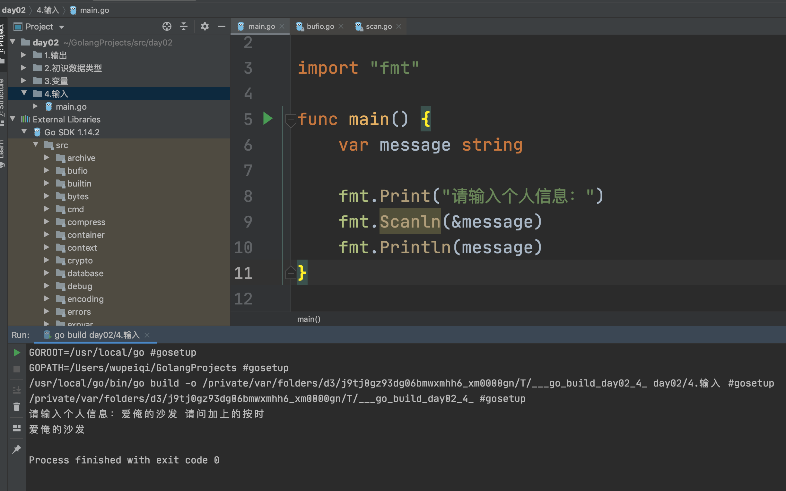

## 一、go程序基础
### 1、文件名
go语言文件名命名规范：
1. go语言的文件名必须以`.go`结尾。
2. go语言的文件名必须以小写字母开头，否则会报错。
3. go语言的文件名不能包含空格，否则会报错。
4. go语言的文件名不能包含特殊字符，否则会报错。
5. go语言的文件名不能包含中文，否则会报错。
6. go语言的文件名不能包含大写字母，否则会报错。

### 2、关键字
关键字是Go语言的保留字，不能用作标识符。

```go
break        default      func         interface    select
case         defer        go           map          struct
chan         else         goto         package      switch
const        fallthrough  if           range        type
continue     for          import       return       var
```

###	3、标识符
标识符以字母或下划线开头，后面可以跟任意数量的字母、数字或下划线。
 - 大小写敏感：如`age`和`Age`是两个不同的标识符。
 - 不能包含空格。如`my age`是非法的标识符。
 - 不能包含特殊字符，如`@`、`#`、`$`等。
 - 仅能包含字母、数字和下划线。如`my-age`是非法的标识符。
 - 不能是Go语言的关键字。如`func`、`if`、`else`等是非法的标识符。
 - 不能是Go语言的预定义标识符。如`true`、`false`、`nil`等是非法的标识符。
 - 不能是Go语言的内置标识符。如`append`、`cap`、`close`等是非法的标识符。
 - 不能是Go语言的保留标识符。如`break`、`case`、`chan`等是非法的标识符。
 - 不能是Go语言的类型名。如`int`、`string`、`bool`等是非法的标识符。
 - _（下划线）是一个特殊的标识符，它可以用来接收任何值，但是它本身不占用内存空间，也不会分配内存空间。
 
### 4、基本结构
Go语言的基本结构如下：
```go	
package main

import "fmt"

func main() {
	fmt.Println("Hello, World! ")
}
```
1. 任何一个代码文件都必须以`package`关键字开头，表示该文件属于哪个包。
2. `import`关键字用于导入其他包。
```go
import "fmt"
import ("time")
// 通常情况下，我们只需要导入一个包，但是如果导入多个包，可以使用括号将多个包括起来
import (
	"fmt"
	"time"
)
```
3. golang可执行程序的入口是`main`函数，`main`函数是`main`包中的一个特殊函数。
```go	
func main() {
	fmt.Println("Hello, World! ")
}
```
4. 包中函数调用：
   - 同一个包中的函数可以直接调用。
   - 不同包中的函数需要通过`import`导入后才能调用。通过`包名.函数名()`的方式调用。
```go
package main

import "fmt"

func main() {
	// 包中函数调用
	test()
}

func test() {
	fmt.Println("test()...")
}
```
 5. 包访问权限：
	- 如果标识符（变量、常量、函数、类型、接口等）的首字母是大写的，那么就表示对外部包可见（暴露的，公有的）。
	- 如果标识符的首字母是小写的，那么就表示对外部包不可见（非暴露的，私有的）。
```go
package main

import "fmt"

func main() {
	// 包访问权限
	test()
}


func test() {
	fmt.Println("test()...")
}
```

#### （1）练习
练习1：写一个程序，对于给定一个数字n,求出所有两两相加等于n的组合。
```go
package main

import "fmt"

func main() {
	// 练习
	var n int
	fmt.Println("请输入一个数字：")
	fmt.Scanln(&n)            // 从键盘输入一个数字，赋值给n
	for i := 1; i <= n; i++ { // i从1开始，到n结束
		for j := 1; j <= n; j++ { // j从1开始，到n结束
			if i+j == n {
				fmt.Printf("%d + %d = %d\n", i, j, n)
			}
		}
	}
}

/*
PS D:\GolangProjects\src\crm> go run test1.go
请输入一个数字：
5
1 + 4 = 5
2 + 3 = 5
3 + 2 = 5
4 + 1 = 5
*/
```

## 二、数据类型
Go是一种静态类型的编程语言，它有一些基本数据类型。

### 1、基本数据类型

1. bool：布尔类型，表示真或假，取值为true或false。
2. string：字符串类型，表示一串字符，用双引号或反引号括起来。
3. int, int8, int16, int32, int64：整数类型，分别表示8位、16位、32位和64位的有符号整数。
4. uint, uint8, uint16, uint32, uint64：无符号整数类型，分别表示8位、16位、32位和64位的无符号整数。
5. float32, float64：浮点数类型，分别表示单精度和双精度浮点数。
6. complex64, complex128：复数类型，分别表示32位和64位的复数。
7. byte：等同于uint8类型。
8. rune：等同于int32类型，用于表示Unicode码点。

除了这些基本数据类型外，Go还有一些复合类型，如数组、切片、映射、结构体等。


```go
package main

import "fmt"

func main() {
	// 整型
	fmt.Println(666)
	fmt.Println(6 + 9)
	fmt.Println(6 - 9)
	fmt.Println(6 * 9)
	fmt.Println(16 / 9) // 商
	fmt.Println(16 % 9) // 余数

	// 字符串类型，特点：通过双引号
	fmt.Println("武沛齐")
	fmt.Println("钓鱼要掉刀鱼，刀鱼到岛上钓")
	fmt.Println("alex" + "SB")
	//fmt.Println("alex" + 666)
	fmt.Println("alex" + "666")
	// 对比
	fmt.Println("1" + "2") // 结果："12"
	fmt.Println(1 + 2)     // 结果：3

	// 布尔类型，真假
	fmt.Println(1 > 2) // false  假
	fmt.Println(1 < 2) // true   真
	fmt.Println(1 == 2)
	fmt.Println(1 >= 2)
	fmt.Println("Alex" == "sb")

	// 超前
	if 2 > 1 {
		fmt.Println("叫爸爸")
	} else {
		fmt.Println("孙子")
	}

}
```

## 三、变量

可以理解为昵称。

- 声明 + 赋值

  ```go
  var sd string = "老男孩alex"
  fmt.Println(sd)
  
  var age int = 73
  fmt.Println(age)
  
  var flag bool = true
  fmt.Println(flag)
  ```

- 先声明后赋值

  ```go
  // 声明了一个字符类型变量 sd
  var sd string
  // 给sd变量赋值
  sd = "老男孩alex"
  fmt.Println(sd)
  ```


### 1、声明变量的意义？

- 编写代码省事

  ```
  // 文本，请将文本输出3次："伤情最是晚凉天，憔悴斯人不堪怜。"
  var message string = "伤情最是晚凉天，憔悴斯人不堪怜。"
  fmt.Println(message)
  fmt.Println(message)
  fmt.Println(message)
  ```

- 存储结果，方便之后使用

  ```
  // 存储结果，方便之后使用
  var v1 int = 99
  var v2 int = 33
  var v3 int = v1 + v2
  var v4 int = v1 * v2
  var v5 int = v1 + v2 + v3 + v4
  fmt.Println(v1, v2, v3, v4, v5)
  ```

- 存储用户输入的值

  ```go
  var name string
  fmt.Scanf("%s", &name) // 用户输入字符串并赋值给name变量
  if name == "alex" {
      fmt.Println("用户名输入正确")
  } else {
      fmt.Println("用户名输入失败")
  }
  ```

### 2、变量名要求

- 【要求】变量名必须只包含：字母、数字、下划线

  ```go
  var %1 string，错误
  var $ string，错误
  ```

- 【要求】数字不能开头

  ```go
  var 1 string  错误
  var 1name string  错误
  var _ string 正确
  ```

- 【要求】不能使用go语言内置的关键字

  ```
  var var string = "南通州北通州南北通州通南北"  错误
  ```

  ```
  break、default、func、interface、select、case、defer、go、map、struct、chan、else、goto、package、switch、const、fallthrough、if、range、type、continue、for、import、return、var
  ```

- 建议
  - 变量名见名知意：name/age/num ;  v1、v2、v3
  - 驼峰式命名：myBossName / startDate

练习题：

```go
var n1 int 
var data bool
var _9 string
```


### 3、变量简写

- 声明+赋值

  ```go
  var name string = "武沛齐"
  
  var name = "武沛齐"
  
  name := "武沛齐"  // 推荐
  ```

- 先声明再赋值

  ```go
  var name string
  var message string
  var data string
  
  var name,message,data string
  name = "武沛齐"
  message = "中奖了"
  data = "中了5000w"
  ```


因式分解，例如：声明5个变量，分别有字符串、整型

```go
var (
    name   = "武沛齐"
    age    = 18
    hobby  = "大保健"
    salary = 1000000
    gender string  // 只声明但不赋值，有一个默认： ""
    length int     // 只声明但不赋值，有一个默认： 0
    sb bool     // 只声明但不赋值，有一个默认： false
)
fmt.Println(name, age, hobby, salary, gender,length,sb)
```


扩展：go编译器会认为声明变量不使用 就是耍流氓。


### 4、作用域

如果我们定义了大括号，那么在大括号中定义的变量。

- 不能被上级使用。
- 可以在同级使用。
- 可以再子级使用。

```go
package main

import "fmt"

func main() {
	name := "武沛齐"
	fmt.Println(name)
	if true {
		age := 18
		name := "alex"
		fmt.Println(age)
		fmt.Println(name)
	}
	fmt.Println(name)
}
```


全局变量和局部变量

- 全局变量，未写在函数中的变量称为全局变量；不可以使用`v1:=xx`方式进行简化；可以基于因式分解方式声明多个变量；项目中寻找变量时最后一环。
- 局部变量，编写在{}里面的变量；可以使用任意方式简化；可以基于因式分解方式声明多个变量；

```go
package main

import "fmt"

// 全局变量（不能以省略的方式）
var school string = "老男孩IT教育" // 可以
//var school = "老男孩IT教育" 	 // 可以
//school := "老男孩IT教育"  		 // 不可以

var (
	v1 = 123
	v2 = "你好"
	v3 int
)

func main() {

	name := "武沛齐" // 局部变量
	fmt.Println(name)
	if true {
		age := 18      // 局部变量
		name := "alex" // 局部变量
		fmt.Println(age)
		fmt.Println(name)
	}
	fmt.Println(name)
	fmt.Println(school)
	fmt.Println(v1, v2, v3)
}
```


### 5、赋值及内存相关

示例1：

```go
name := "武沛齐"
```


示例2：

```go
name := "武沛齐"
nickname := name
```


注意：这一点与python不同。

```go
package main

import "fmt"

func main() {
	name := "武沛齐"
	nickname := name

	fmt.Println(name, &name)
	fmt.Println(nickname, &nickname)
}

```


示例3：

```go
name := "武沛齐"
nickname := name

name = "alex"
```


```go
package main

import "fmt"

func main() {
	name := "武沛齐"
	nickname := name
	fmt.Println(name, &name)
	fmt.Println(nickname, &nickname)

	name = "alex"
	fmt.Println(name, &name)
	fmt.Println(nickname, &nickname)
}
```

#### 注意事项

使用int、string、bool这三种数据类型时，如果遇到变量的赋值则会拷贝一份。【值类型】

```go
name := "武沛齐"
nickname := name
```

提示：后续在数据类型中会详细再讲解。


## 阶段练习题

1. `package main`的作用？

2. 单行注释和多行注释分别是什么？

3. 下面声明变量的方式错误的有哪些？

   ```go
   var name = "武沛齐"
   var age int = 18
   hobby = "嫂子"
   nickName string = "一米八大高个"
   webSite := "秃头统治地球"
   ```

   ```go
   var age int = 18
   age = 19
   ```

4. 下面声明变量的方式正确的有哪些？

   ```go
   var v1,v2,v3 int
   var (
   	v6 = 123
       v7 string
   )
   var v4,v5 = 11,22
   v4,v5 = 11,22
   v4,v5 := 11,22
   ```

5. 变量名规范。

6. 看代码写结果

   ```go
   package main
   
   import "fmt"
   
   var number = 9999
   
   func main() {
   	number := 666
   	fmt.Println(number)
   }
   ```

7. 看代码写结果

   ```go
   package main
   
   import "fmt"
   
   var number = 99
   
   func main() {
   	number := 66
   	if true {
   		number := 33
   		fmt.Println(number)
   	}
   	fmt.Println(number)
   }
   ```

8. 看代码写结果

   ```go
   package main
   
   import "fmt"
   
   var number = 99
   
   func main() {
   	number := 66
   	if true {
   		number := 33
   		fmt.Println(number)
   	}
   	number = 88
   	fmt.Println(number)
   }
   ```

9. 看代码写结果

   ```go
   package main
   
   import "fmt"
   
   var number = 99
   
   func main() {
   	if true {
   		fmt.Println(number)
   	}
   	number = 88
   	fmt.Println(number)
   }
   ```

10. 看代码写结果

    ```go
    package main
    
    import "fmt"
    
    var number = 99
    
    func main() {
    	number := 88
    	if true {
    		number = 123
    		fmt.Println(number)
    	}
    	fmt.Println(number)
    }
    
    ```

11. 看代码写结果

    ```go
    package main
    
    import "fmt"
    
    var number = 99
    
    func main() {
    	fmt.Println(number)
    	number := 88
    	if true {
    		number = 123
    		fmt.Println(number)
    	}
    	fmt.Println(number)
    }
    ```

    

## 四、常量

不可被修改的变量。

```go
package main

import "fmt"

func main() {
	// 定义变量
	//var name string = "武沛齐"
	//var name = "武沛齐"
	name := "武沛齐"
	name = "alex"
	fmt.Println(name)

	// 定义常量
	//const age int = 98
	const age = 98
	fmt.Println(age)
}
```


### 1、因式分解

```go
package main

import "fmt"


func main() {
	// 定义变量
	//var name string = "武沛齐"
	//var name = "武沛齐"
	name := "武沛齐"
	name = "alex"
	fmt.Println(name)

	// 定义常量
	//const age int = 98
	const age = 98
	fmt.Println(age)

	// 常量因式分解
	const (
		v1 = 123
		v2 = 456
		pi = 9.9
	)
	fmt.Println(v1, v2, pi, gender)
}

```


### 2、全局

```go
package main

import "fmt"

const Data = 999
const (
	pi     = 3.1415926
	gender = "男"
)

func main() {
	// 定义变量
	//var name string = "武沛齐"
	//var name = "武沛齐"
	name := "武沛齐"
	name = "alex"
	fmt.Println(name)

	// 定义常量
	//const age int = 98
	const age = 98
	fmt.Println(age)

	// 常量因式分解
	const (
		v1 = 123
		v2 = 456
		//pi = 9.9
	)
	fmt.Println(v1, v2, pi, gender)
}

```


### 3、iota

可有可无，当做一个在声明常量时的一个计数器。

```go
package main

const (
	monday = iota + 1
	tuesday
	wednesday
	thursday
	friday
	saturday
	sunday
)

const (
	n1 = iota
	n2
	n3
)

func main() {

	// iota
	// 示例1
	/*
		const (
			v1 = 1
			v2 = 2
			v3 = 3
			v4 = 4
			v5 = 5
		)
		fmt.Println(v1, v2, v3, v4, v5)
	*/

	// 示例2
	/*
		const (
			v1 = iota
			v2
			v3
			v4
			v5
		)
		fmt.Println(v1, v2, v3, v4, v5)
	*/

	// 示例3
	/*
		const (
			v1 = iota + 2
			v2
			v3
			v4
			v5
		)
		fmt.Println(v1, v2, v3, v4, v5)
	*/

	// 示例4：
	/*
		const (
			v1 = iota + 2
			_
			v2
			v3
			v4
			v5
		)
		fmt.Println(v1, v2, v3, v4, v5)
	*/

}
```


## 五、输入

让用户输入数据，完成项目交互。

- fmt.Scan
- fmt.Scanln
- fmt.Scanf


```go
package main

import "fmt"

func main() {
	// 示例1：fmt.Scan
	/*
		var name string
		fmt.Println("请输入用户名：")
		fmt.Scan(&name)
		fmt.Printf(name)
	*/

	// 示例2：fmt.Scan
	var name string
	var age int

	fmt.Println("请输入用户名：")
	// 当使用Scan时，会提示用户输入
	// 用户输入完成之后，会得到两个值：count,用户输入了几个值；err，用输入错误则是错误信息
	_, err := fmt.Scan(&name, &age)
	if err == nil {
		fmt.Println(name, age)
	} else {
		fmt.Println("用户输入数据错误", err)
	}
	// 特别说明：fmt.Scan 要求输入两个值，必须输入两个，否则他会一直等待。
}

```


```go
package main

import "fmt"

func main() {
	// 示例1：fmt.Scanln
	/*
		var name string
		fmt.Print("请输入用户名：")
		fmt.Scanln(&name)
		fmt.Printf(name)
	*/

	// 示例2：fmt.Scanln

	var name string
	var age int
	fmt.Print("请输入用户名：")
	// 当使用Scanln时，会提示用户输入
	// 用户输入完成之后，会得到两个值：count,用户输入了几个值；err，用输入错误则是错误信息
	count, err := fmt.Scanln(&name, &age)
	fmt.Println(count, err)
	fmt.Println(name, age)

	// 特别说明：fmt.Scanln 等待回车。
}
```


```go
package main

import "fmt"

func main() {
	var name string
	var age int

	fmt.Print("请输入用户名：")
	_, _ = fmt.Scanf("我叫%s 今年%d 岁", &name, &age)
	fmt.Println(name, age)
}
```


无法解决的难题？



```go
package main

import (
	"bufio"
	"fmt"
	"os"
)

func main() {
	reader := bufio.NewReader(os.Stdin)
	// line，从stdin中读取一行的数据（字节集合 -> 转化成为字符串）
	// reader默认一次能4096个字节（4096/3)
	//    1. 一次性读完，isPrefix=false
	// 	  2. 先读一部分，isPrefix=true，再去读取isPrefix=false
	line, _, _ := reader.ReadLine()
	data := string(line)
	fmt.Println(data)
}

```


## 六、条件语句


### 8.1 最基本

```go
if 条件 {
    成立后，此代码块执行
}else{
    不成立，此代码块执行
}
```

```go
if 条件 {
    成立后，此代码块执行
}
```

示例：

```go
package main

func main() {
	/*
		if true {
			fmt.Println("666")
		}else{
			fmt.Println("999")
		}
	*/

	/*
		if 1 > 2 {
			fmt.Println("666")
		} else {
			fmt.Println("999")
		}
	*/

	/*
		flag := false
		if flag {
			fmt.Println("条件成立")
		}else{
			fmt.Println("条件不成立")
		}
	*/

	// 练习题1:用户输入姓名，判断是否正确
	/*
		var name string
		fmt.Print("请输入姓名：")
		fmt.Scanln(&name)
		if name == "alex" {
			fmt.Println("用户名输入正确")
		} else {
			fmt.Println("用户名输入错误")
		}
	*/
	// 练习题2:用户输入数字，判断奇数、偶数
	/*
		var number int
		fmt.Print("请输入数字：")
		fmt.Scanln(&number)
		if number % 2 == 0{
			fmt.Println("您输入的是偶数")
		}else{
			fmt.Println("您输入的是奇数")
		}
	*/
	// 练习题3:用户和密码，判断用户名密码是否正确。
	/*


		var username, password string
		fmt.Print("请输入用户名：")
		fmt.Scanln(&username)

		fmt.Print("请输入密码：")
		fmt.Scanln(&password)

		if username == "alex" && password == "sb" {
			fmt.Println("欢迎登录pornhub")
		} else {
			fmt.Println("用户名或密码错误")
		}
	*/
	// 练习题4:请输入用户名校验是否是VIP
	/*
		var username string
		fmt.Print("请输入用户名：")
		fmt.Scanln(&username)

		if username == "alex" || username == "eric" {
			fmt.Println("天上人间大VIP")
		} else {
			fmt.Println("屌丝")
		}
	*/
}

```


### 8.2 多条件判断

```go
if 条件A{
    ...
}else if 条件B{
    ...
}else if 条件C{
    ...
}else{
    ...
}
```

示例：

```go
package main

import "fmt"

func main() {
	var length int
	fmt.Print("请输入你的长度：")
	fmt.Scanln(&length)

	if length < 1 {
		fmt.Println("没用的东西，还特么是坑")
	} else if length < 6 {
		fmt.Println("刚刚能用")
	} else if length < 18 {
		fmt.Println("生活和谐")
	} else {
		fmt.Println("太特么大了")
	}
}
```

### 8.3 嵌套

```go
package main

import "fmt"

func main() {
	fmt.Println("欢迎致电10086，1.话费相关；2.业务办理；3.人工服务。")

	var number int
	fmt.Scanln(&number)

	if number == 1 {
		fmt.Println("话费服务，1.交话费；2.查询。")
		var n1 int
		fmt.Scanln(&n1)
		if n1 == 1 {
			fmt.Println("缴话费啦")
		} else if n1 == 2 {
			fmt.Println("查话费了")
		} else {
			fmt.Println("输入错误")
		}
	} else if number == 2 {
		fmt.Println("业务办理")
	} else if number == 3 {
		fmt.Println("人工服务")
	} else {
		fmt.Println("输入错误")
	}
	
	// 建议：条件的嵌套不要太多
}
```


## 今日作业

1. 提⽰⽤户输入⿇花藤. 判断⽤户输入的对不对。如果对, 提⽰真聪明, 如果不对, 提⽰你 是傻逼么。

2. 提示用户输入两个数字，计算两个数的和并输出。

3. 提示用户输入姓名、位置、行为三个值，然后做字符串的拼接 并输出，例如：xx 在 xx 做 xx 。

4. 设定一个理想数字比如：66，让用户输入数字，如果比66大，则显示猜测的结果大了；如果比66小，则显示猜测的结果小了;只有等于66，显示猜测结果正确。

5. 写程序，输出成绩等级。成绩有ABCDE5个等级，与分数的对应关系如下.

   ```
   A    90-100
   B    80-89
   C    60-79
   D    40-59
   E    0-39
   ```

   要求用户输入0-100的数字后，正确输出他的对应成绩等级。


老师微信：wupeiqi666


